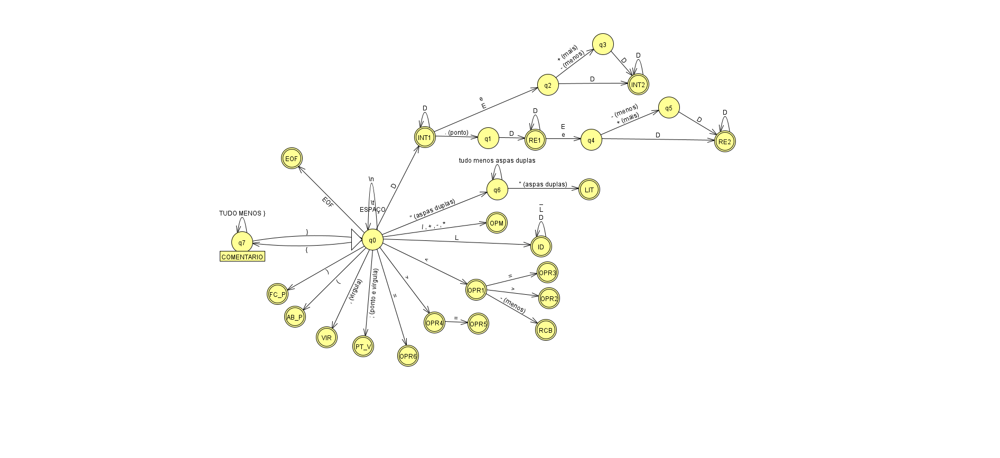

# mgol-compiler
## Repositório para projeto de compilador como estudo de caso particular da linguagem Mgol, para disciplina de Compiladores 1 - EC-UFG.
### PS: Se você está pensando em copiar esse código pra apresentar, repense, porque a Profª tem o código do meu envio e você vai tirar 0 (zero) 😉.
#### Projeto finalizado gerando código fonte .C a partir da linguagem MGol conforme as definições nos PDFs na pasta [/definicoes](definicoes). Feito em Java e com o projeto Maven usando a biblioteca do Google Guava pra Tabela de 2 Keys e 1 Value


As definições das palavras reservadas da linguagem MGol estão em [Definições](definicoes/Descricao-T1-2023-1-Compiladores.pdf) e está na imagem abaixo o Automato do léxico da linguagem. Tambem está o arquivo do [JFlap](https://www.jflap.org/) com o automato no formato da ferramenta ```.jff```.



A gramática da linguagem está em [GRAMATICA_MGOL.TXT](definicoes/GRAMATICA_MGOL.TXT) que é importada no programa para fazer o parsing do arquivo.

## Funcionamento do compilador.
A lógica utilizada foi fazer as 3 etapas do trabalho separadamente. 
- T1 é o Léxico onde está implementado o reconhecimento de Tokens Válidos da linguagem e a tabela de símbolos. 
- T2 é o Sintático, onde executa um algoritmo do Shift-Reduce com a [tabela do Automato SLR1 da gramática linguagem](definicoes/TABELA_ACTION_GOTO_UNICA.csv); 
- T3 é o Semântico, porém o Semântico com a Geração de Código é uma [função acoplada dentro do Sintático](https://github.com/alancmag/mgol-compiler/blob/bb2267114890cb0f7918b13e095e77c527408679/src/main/java/br/ufg/inf/compiladores/sintatico/Parser.java#L97C7-L97C7) . Usando a Tradução Dirigida pela Sintaxe onde em cada Redução, é feito um passo da tradução. 

## Exemplo de código MGol de entrada
``` 
inicio
varinicio
literal A;
literal B,C;
inteiro D;
inteiro E,F;
real G;
real H,TESTE;
varfim;
escreva "\nDigite Literal A: ";
leia A;
escreva A;
escreva "\nDigite Inteiro D: ";
leia D;
escreva D;
escreva "\nDigite Real G: ";
leia G;
escreva G;
se(D>2)
entao
	se(D<=22)
	entao
		escreva "\nD esta entre 2 e 22\n";
	fimse
fimse
escreva "\nvalor de G=";
escreva G;
escreva "\n";
repita (G>0.1)
    escreva "\nG=";
    escreva G;
    escreva "\n";
    se(G>3.0) entao
        se(G<=9.0) entao
            escreva "\nG esta entre 3.0 e 9.0\n";
        fimse
    fimse
    G<-G-1.0;
fimrepita
G<-10.0;
repita (G>0.1)
    escreva "\nDIGITE UM NUMERO REAL MENOR QUE 0.1 PARA SAIR DO LOOP\n";
    leia G;
    se(G>0.1) entao
        escreva "\nVoce digitou um numero MAIOR que o ESPERADO para sair\n";
    fimse
    G<-G-1.5;
fimrepita
se(D=D) entao 
    escreva "\nD=D\n";
fimse
escreva "\nFINALIZOU\n";
fim
```

## Exemplo de código .C de saida do código acima
``` C
#include<stdio.h>
typedef char literal[256];
void main(void)
{/*----Variaveis temporarias----*/
int T0;
int T1;
double T2;
double T3;
double T4;
double T5;
double T6;
double T7;
double T8;
int T9;
/*------------------------------*/
literal A;
literal B,C;
int D;
int E,F;
double G;
double H,TESTE;


printf ("\nDigite Literal A: ");
scanf ("%s",A);
printf ("%s",A);
printf ("\nDigite Inteiro D: ");
scanf ("%d",&D);
printf ("%d",D);
printf ("\nDigite Real G: ");
scanf ("%lf",&G);
printf ("%lf",G);
T0 = D>2;
if (T0) {
	T1 = D<=22;
	if (T1) {
		printf ("\nD esta entre 2 e 22\n");
	}
}
printf ("\nvalor de G=");
printf ("%lf",G);
printf ("\n");
T2 = G>0.1;
while (T2) {
	printf ("\nG=");
	printf ("%lf",G);
	printf ("\n");
	T3 = G>3.0;
	if (T3) {
		T4 = G<=9.0;
		if (T4) {
			printf ("\nG esta entre 3.0 e 9.0\n");
		}
	}
	T5 = G-1.0;
	G=T5;
	T2 = G>0.1;
}
G=10.0;
T6 = G>0.1;
while (T6) {
	printf ("\nDIGITE UM NUMERO REAL MENOR QUE 0.1 PARA SAIR DO LOOP\n");
	scanf ("%lf",&G);
	T7 = G>0.1;
	if (T7) {
		printf ("\nVoce digitou um numero MAIOR que o ESPERADO para sair\n");
	}
	T8 = G-1.5;
	G=T8;
	T6 = G>0.1;
}
T9 = D==D;
if (T9) {
	printf ("\nD=D\n");
}
printf ("\nFINALIZOU\n");
}
```
Faça bom proveito. 